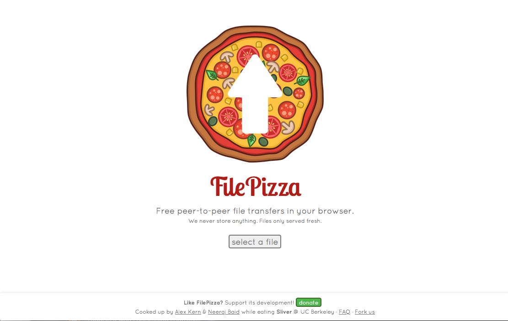

<!--
Este archivo README esta generado automaticamente<https://github.com/YunoHost/apps/tree/master/tools/readme_generator>
No se debe editar a mano.
-->

# FilePizza para Yunohost

[](https://ci-apps.yunohost.org/ci/apps/filepizza/)


[](https://install-app.yunohost.org/?app=filepizza)

*[Leer este README en otros idiomas.](./ALL_README.md)*

> *Este paquete le permite instalarFilePizza rapidamente y simplement en un servidor YunoHost.*  
> *Si no tiene YunoHost, visita [the guide](https://yunohost.org/install) para aprender como instalarla.*

## Descripción general

Using WebRTC, FilePizza eliminates the initial upload step required by other web-based file sharing services. When senders initialize a transfer, they receive a "tempalink" they can distribute to recipients. Upon visiting this link, recipients' browsers connect directly to the sender’s browser and may begin downloading the selected file. Because data is never stored in an intermediary server, the transfer is fast, private, and secure.

**Versión actual:** 2024.12.29~ynh1

**Demo:** <https://file.pizza/>

## Capturas



## :red_circle: Características no deseables

- **Upstream not maintained**: This software is not maintained anymore. Expect it to break down over time, be exposed to unfixed security breaches, etc.

## Documentaciones y recursos

- Sitio web oficial: <https://file.pizza/>
- Repositorio del código fuente oficial de la aplicación : <https://github.com/kern/filepizza>
- Catálogo YunoHost: <https://apps.yunohost.org/app/filepizza>
- Reportar un error: <https://github.com/YunoHost-Apps/filepizza_ynh/issues>

## Información para desarrolladores

Por favor enviar sus correcciones a la [rama `testing`](https://github.com/YunoHost-Apps/filepizza_ynh/tree/testing).

Para probar la rama `testing`, sigue asÍ:

```bash
sudo yunohost app install https://github.com/YunoHost-Apps/filepizza_ynh/tree/testing --debug
o
sudo yunohost app upgrade filepizza -u https://github.com/YunoHost-Apps/filepizza_ynh/tree/testing --debug
```

**Mas informaciones sobre el empaquetado de aplicaciones:** <https://yunohost.org/packaging_apps>
