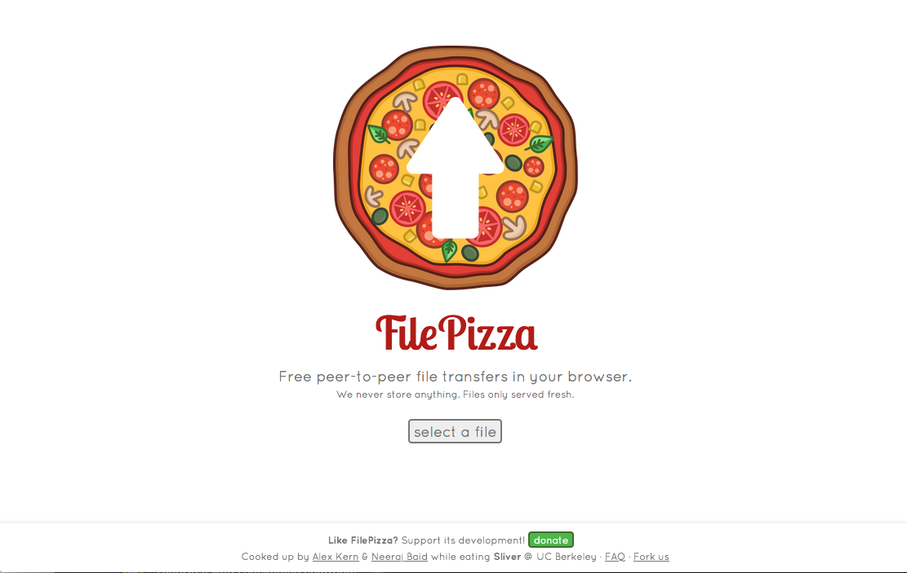

# FilePizza pour YunoHost

[](https://dash.yunohost.org/appci/app/filepizza)    
[](https://install-app.yunohost.org/?app=filepizza)

*[Read this readme in english.](./README.md)*
*[Lire ce readme en français.](./README_fr.md)*

> *Ce package vous permet d'installer FilePizza rapidement et simplement sur un serveur YunoHost.
Si vous n'avez pas YunoHost, regardez [ici](https://yunohost.org/#/install) pour savoir comment l'installer et en profiter.*

## Vue d'ensemble

Using WebRTC, FilePizza eliminates the initial upload step required by other web-based file sharing services. When senders initialize a transfer, they receive a "tempalink" they can distribute to recipients. Upon visiting this link, recipients' browsers connect directly to the sender’s browser and may begin downloading the selected file. Because data is never stored in an intermediary server, the transfer is fast, private, and secure.

**Version incluse :** 1.8.7~ynh1

**Démo :** https://file.pizza/

## Captures d'écran



## Documentations et ressources

* Site officiel de l'app : https://file.pizza/
* Dépôt de code officiel de l'app : https://github.com/kern/filepizza
* Documentation YunoHost pour cette app : https://yunohost.org/app_filepizza
* Signaler un bug : https://github.com/YunoHost-Apps/filepizza_ynh/issues

## Informations pour les développeurs

Merci de faire vos pull request sur la [branche testing](https://github.com/YunoHost-Apps/filepizza_ynh/tree/testing).

Pour essayer la branche testing, procédez comme suit.
```
sudo yunohost app install https://github.com/YunoHost-Apps/filepizza_ynh/tree/testing --debug
ou
sudo yunohost app upgrade filepizza -u https://github.com/YunoHost-Apps/filepizza_ynh/tree/testing --debug
```

**Plus d'infos sur le packaging d'applications :** https://yunohost.org/packaging_apps